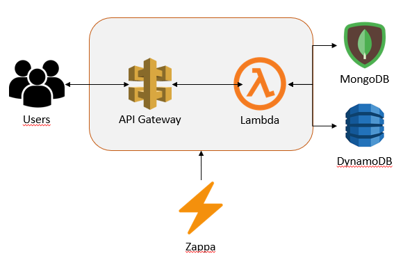
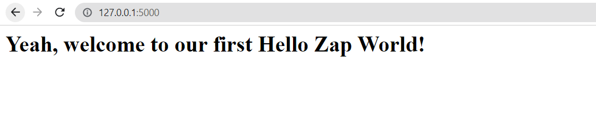

# How to deploy an API with Zappa

## ****Zappa - Serverless Python Library****

<aside>
⚡ **Zappa** makes it super easy to build and deploy server-less, event-driven Python applications on *AWS Lambda* + *API Gateway*. Think of it as "serverless" web hosting for your Python apps. That means **infinite scaling**, **zero downtime**, **zero maintenance** - and at a fraction of the cost of your current deployments!

</aside>

[https://github.com/zappa/Zappa](https://github.com/zappa/Zappa)

## What can we do?

**Zappa allow us to deploy and expose an API** in our AWS account, with only 3 commands. You can see the infrastructure that Zappa can create for you in the following image:



## How can we do a *Hello World*?

For **this example** we will create an **API with Flask**, we will upload it in a **Lambda** and then we will expose this API deploying it in **API Gateway**.

<aside>
💡 *Before you begin, make sure you are running **Python 3.7/3.8/3.9** and you have a **valid AWS account** and your [AWS credentials file](https://blogs.aws.amazon.com/security/post/Tx3D6U6WSFGOK2H/A-New-and-Standardized-Way-to-Manage-Credentials-in-the-AWS-SDKs) is properly installed.*

</aside>

### Step 1: Install the requirements.

```bash
# Only if you don't have the virtual environment yet
pip install virtualenv==20.16.5
virtualenv venv
venv/bin/activate

pip install zappa==0.55.0
pip install flask==2.2.2
pip install python-dotenv==0.21.0

# We are using python==3.9.7 for this example
```

Please note that Zappa ***must*** be installed into your project's [virtual environment](http://docs.python-guide.org/en/latest/dev/virtualenvs/). The virtual environment name should not be the same as the Zappa project name, as this may cause errors.

### Step 2: Create a simple Flask app

Create a file called `app.py` in the main project directory you have. Inside `app.py`, paste the following code. This super simple Flask app creates one webpage that displays the text **Yeah, welcome to our first Hello Zap World!**. You can modify the text between the `<h1> .... </h1>` tags to include any message you want.

```python
from flask import Flask
import boto3

app = Flask(__name__)

@app.route('/')
def hello_world():
    return '<h1>Yeah, welcome to our first Hello Zap World!</h1>'

if __name__ == '__main__':
    app.run()
```

Next, let's test the Flask app locally. We want to make sure the web app runs on our computer correctly before we deploy the app with Zappa on AWS Lambda. Make sure you are in the venv.

```bash
flask run
```

Browse to the URL shown in the terminal [http://127.0.0.1:5000/](https://pythonforundergradengineers.com/Running%20on%20http://127.0.0.1:5000/). The webpage should look something like the screenshot below.



### Step 3: **Create a Zappa settings file**

Next, we need to create the Zappa settings file: `zappa_settings.json`. Create this file by typing the command `zappa init` into a terminal *(remember the virtual environment `(venv)` needs to be active when the command is entered).*

```python
zappa init
```

We can define it also manually. Here you have an example:

```json
{
    "dev": {
        "app_function": "app.app",
        "profile_name": "<aws_profile_name>",
        "project_name": "<project_name>",
        "keep_warm": false,
        "runtime": "python3.9",
        "s3_bucket": "<aws_bucket_name>",
        "aws_region": "eu-west-1"
    }
}
```

### Step 4: Define requirements.txt file

Before we deploy our web app on AWS Lambda (we are almost done!), we'll create a `requirements.txt` file using `pip freeze`.

```bash
pip freeze > requirements.txt
```

The following files should now be in the main project directory:

```markdown
main_project_directory/
	- venv/
	- app.py
	- requirements.txt
	- zappa_settings.json
```

### Step 5: Deploy Flask API to AWS

```bash
zappa deploy dev
```

If everything worked, you should be able to browse to the URL listed in the terminal (something like [https://heq5x2wioxcz.execute-api.us-west-2.amazonaws.com/dev](https://heq5x2wioxcz.execute-api.us-west-2.amazonaws.com/dev)) and see your web app running in all its serverless glory.

## Considerations

1. Please note that Zappa ***must*** be installed into your project's [virtual environment](http://docs.python-guide.org/en/latest/dev/virtualenvs/). The virtual environment name should not be the same as the Zappa project name, as this may cause errors.
2. We can **update** the content of the **Lambda at any time**. This command will update the Lambda in a new version and will tag it as the latest version for you:

```bash
zappa update
```

1. We ***must*** **have created an aws credentials** before try this example. I highly recommend to create a group of users, with a specific policy and then create the users you want on it.
    
    However, **here you have an initial policy** to validate that hello zap world. Make sure you update the `<account_id>` and `<bucket_name>` spaces according with your account and project:
    

```json
{
    "Version": "2012-10-17",
    "Statement": [
        {
            "Effect": "Allow",
            "Action": [
                "iam:UpdateAssumeRolePolicy",
                "iam:AttachRolePolicy",
                "iam:CreateRole",
                "iam:GetRole",
                "iam:PutRolePolicy"
            ],
            "Resource": [
                "*"
            ]
        },
        {
            "Effect": "Allow",
            "Action": [
                "iam:PassRole"
            ],
            "Resource": [
                "arn:aws:iam::<account_id>:role/*-ZappaLambdaExecutionRole"
            ]
        },
        {
            "Effect": "Allow",
            "Action": [
                "apigateway:DELETE",
                "apigateway:GET",
                "apigateway:PATCH",
                "apigateway:POST",
                "apigateway:PUT",
                "events:DeleteRule",
                "events:DescribeRule",
                "events:ListRules",
                "events:ListTargetsByRule",
                "events:ListRuleNamesByTarget",
                "events:PutRule",
                "events:PutTargets",
                "events:RemoveTargets",
                "lambda:AddPermission",
                "lambda:CreateFunction",
                "lambda:DeleteFunction",
                "lambda:DeleteFunctionConcurrency",
                "lambda:GetFunction",
                "lambda:GetPolicy",
                "lambda:ListVersionsByFunction",
                "lambda:RemovePermission",
                "lambda:UpdateFunctionCode",
                "lambda:UpdateFunctionConfiguration",
                "lambda:GetAlias",
                "lambda:GetFunctionConfiguration",
                "cloudformation:CreateStack",
                "cloudformation:DeleteStack",
                "cloudformation:DescribeStackResource",
                "cloudformation:DescribeStacks",
                "cloudformation:ListStackResources",
                "cloudformation:UpdateStack",
                "logs:DescribeLogStreams",
                "logs:FilterLogEvents",
                "route53:ListHostedZones",
                "route53:ChangeResourceRecordSets",
                "route53:GetHostedZone",
                "s3:CreateBucket"
            ],
            "Resource": [
                "*"
            ]
        },
        {
            "Effect": "Allow",
            "Action": [
                "s3:ListBucket"
            ],
            "Resource": [
                "arn:aws:s3:::<bucket_name>"
            ]
        },
        {
            "Effect": "Allow",
            "Action": [
                "s3:DeleteObject",
                "s3:GetObject",
                "s3:PutObject",
                "s3:AbortMultipartUpload",
                "s3:ListMultipartUploadParts",
                "s3:ListBucketMultipartUploads"
            ],
            "Resource": [
                "arn:aws:s3:::<bucket_name>/*"
            ]
        }
    ]
}
```

1. We can check the status of our deploy just using the following command. It will help us to get more traceback if we are having some troubles on the deploy:

```python
zappa status
```

# Have a good Zappa Zappa! ⚡